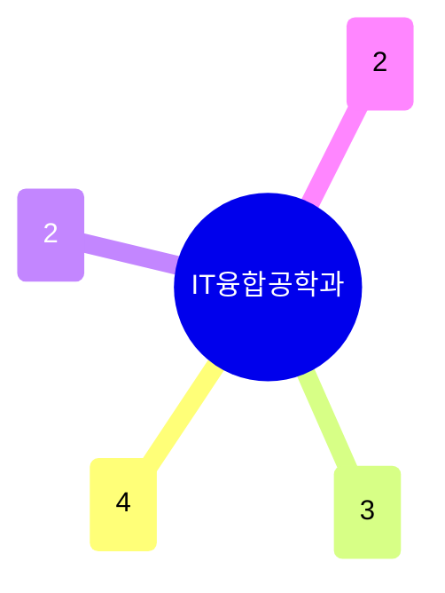

# IT융합공학과

이름 그대로 전자공학·의공학·신경과학이 만나는 융합 학과다. **뇌과학·신경조절**(4명, BMI·신경면역·초음파 신경조절)이 가장 크고, **의료영상·헬스케어 디바이스**(3명)가 뒤를 잇는다. 기술이전(13건)이 학과 규모 대비 매우 높아 — 의료기기 상용화 지향성이 뚜렷하다.

## 실적 요약

| 구분 | 건수 |
|---|---|
| 주도논문 | 142 |
| 공동논문 | 45 |
| 특허 | 75 |
| 과제 | 286 |
| 학회 | 215 |
| 저서 | 1 |
| 기술이전 | 13 |

## 교원 목록

### 뇌과학·신경조절
- [김도형](../faculty/101744-김도형.md) — Systems Neuroscience, Invasive BMI
- [김종신](../faculty/101560-김종신.md) — Neuroimmunology, Vascular Biology, CNS Barriers
- [김형함](../faculty/100775-김형함.md) — High-frequency Ultrasound, Neuromodulation
- [유창현](../faculty/102152-유창현.md) — Neurobiology of Sexual Function, Neuro-immune

### 의료영상·헬스케어 디바이스
- [김철홍](../faculty/100543-김철홍.md) — Multimodal Imaging, AI in Healthcare
- [박성민](../faculty/100730-박성민.md) — Implantable/Wearable Bioelectronic Medicine
- [박주홍](../faculty/100893-박주홍.md) — IoT/Smart Cities, Healthcare Architecture

### 나노소자·컴퓨팅
- [백창기](../faculty/100612-백창기.md) — Nanoscale Device Simulation, Neuromorphic Devices
- [한수희](../faculty/100647-한수희.md) — Real-time RL, Battery Informatics

### 로보틱스·면역
- [안용주](../faculty/101635-안용주.md) — Trained Innate Immunity, Stroke/Atherosclerosis
- [유선철](../faculty/100269-유선철.md) — Field Robotics, Nuclear Power Plant Robot

---
[← home](../home.md) · [색인](../index.md)
