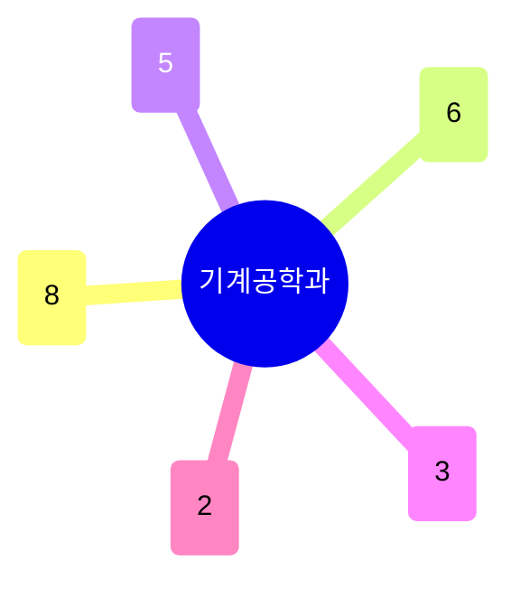

# 기계공학과

24명 규모에 주도논문(334건)·기술이전(25건) 모두 학과 중 최상위권 — 실험실 성과의 산업 전이가 활발하다. **열유체·에너지시스템**이 가장 큰 축(8명)이고, **마이크로/나노 제조·MEMS/바이오소자**가 그 뒤를 잇는다(6명). **로보틱스·바이오메디컬 로봇**, **소프트소재·바이오프린팅**, **광학·포토닉스**가 각각 독립된 소그룹을 이룬다.

## 실적 요약

| 구분 | 건수 |
|---|---|
| 주도논문 | 334 |
| 공동논문 | 103 |
| 특허 | 126 |
| 과제 | 560 |
| 학회 | 403 |
| 저서 | 3 |
| 기술이전 | 25 |

## 교원 목록

### 열유체·에너지시스템
- [김동식](../faculty/20422-김동식.md) — Laser Materials Processing, Microscale Heat Transfer
- [박형규](../faculty/101029-박형규.md) — Low-D Fluidics, Iontronics, 2D Nanomaterial Membranes
- [신동일](../faculty/101954-신동일.md) — Multi-scale Co-design Simulation
- [안지환](../faculty/101701-안지환.md) — Energy Conversion/Storage, Atomic Layer Manufacturing
- [유동현](../faculty/100446-유동현.md) — Computational Flow Physics, AI for Fluid Mechanics
- [이상준](../faculty/20037-이상준.md) — Biomimetic Drag Reduction, Desalination
- [조항진](../faculty/101048-조항진.md) — Heat & Fluid Transfer, Boiling/Condensation
- [진현규](../faculty/100799-진현규.md) — Thermal Energy Conversion, Thermoelectric

### 마이크로/나노 제조·MEMS·바이오소자
- [김동성](../faculty/100302-김동성.md) — Nano/Micro Manufacturing, Biomaterial Structures
- [김석](../faculty/101366-김석.md) — Smart Surfaces, Transfer Printing, MEMS/NEMS
- [김준원](../faculty/20620-김준원.md) — MEMS/NEMS, Microfluidic Bio/Medical Devices
- [문원규](../faculty/20356-문원규.md) — Transducers for Acoustics/Vibration, Nano/Bio
- [박재성](../faculty/100072-박재성.md) — Micro/Nano Devices, Bioartificial Liver, Biosensors
- [임근배](../faculty/20561-임근배.md) — Micro/Nano Fabrication, Drug Delivery, Biosensors

### 로보틱스·바이오메디컬 로봇
- [강대식](../faculty/102144-강대식.md) — Neural Engineering/BMI, Soft Robotics
- [고제성](../faculty/102235-고제성.md) — Soft Robotics, Origami-inspired Robots
- [김기훈](../faculty/101199-김기훈.md) — Robotics, Bilateral Teleoperation, Exoskeleton
- [김진태](../faculty/101836-김진태.md) — Fluid Integrated Electronics, UAV, Soft Electronics
- [신원동](../faculty/102150-신원동.md) — Bio-inspired Robots, Elastic Actuation

### 소프트소재·바이오프린팅
- [이안나](../faculty/101031-이안나.md) — Mechanical Instability, Soft Sensors/Actuators
- [장진아](../faculty/100846-장진아.md) — Bioprinting, Transplantable Tissues
- [한승용](../faculty/102236-한승용.md) — Soft/Bio-integrated Sensors, Shape-changing Materials

### 광학·포토닉스
- [김기현](../faculty/100155-김기현.md) — Photonic Machine System, Optical Microscopy
- [노준석](../faculty/100644-노준석.md) — Metamaterials, Plasmonics, Photonics for AI

---
[← home](../home.md) · [색인](../index.md)
