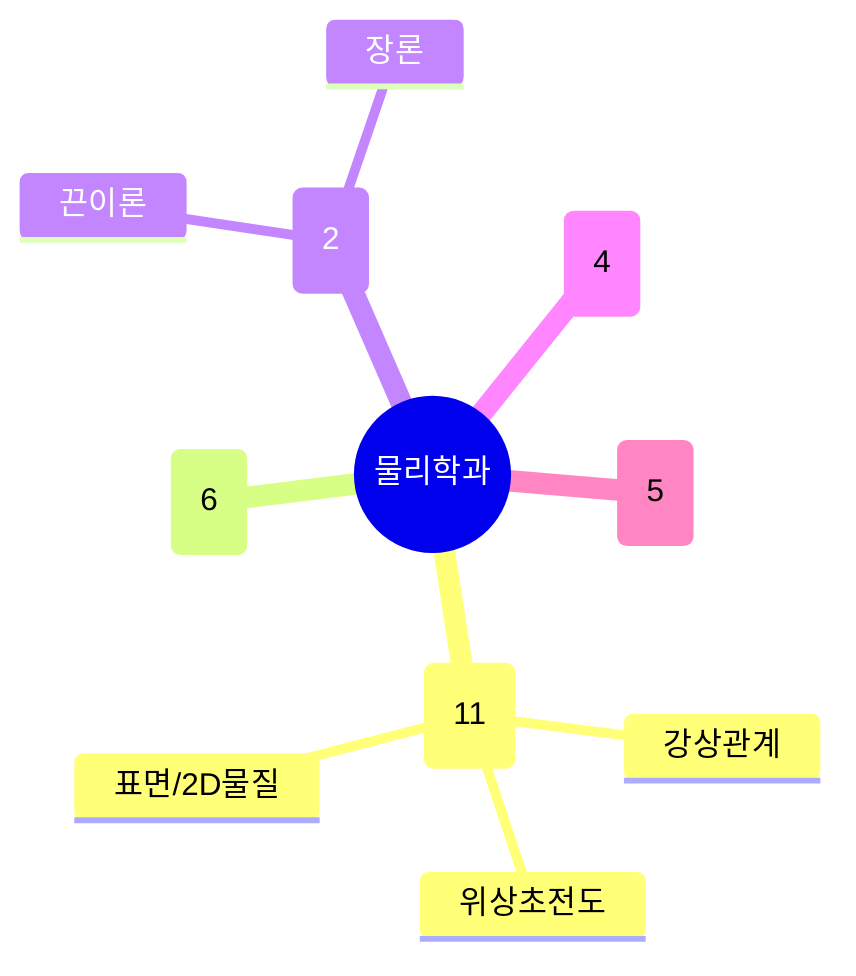

# 물리학과

POSTECH 물리학과는 **응집물질/양자물질 실험**이 가장 두꺼운 축(11명, 39%)이고, 그 위에 **양자정보·양자광학**이 뚜렷한 둘째 축(6명)으로 자리잡는다. 강상관계·위상초전도·스핀 관련 그룹이 서로 겹치며 협업 지형을 이루고, 소수의 **이론물리**(끈이론/장론), **계산물성·초고속분광**, **생물물리·플라즈마**가 주변부를 구성한다. 학과 포털(`ph.postech.ac.kr`, 2명 공유)은 위키 크롤링 대상에서 제외되어 있다.

## 실적 요약

| 구분 | 건수 |
|---|---|
| 주도논문 | 190 |
| 공동논문 | 111 |
| 특허 | 31 |
| 과제 | 633 |
| 학회 | 389 |
| 저서 | 4 |
| 기술이전 | 3 |

## 교원 목록

### 응집물질·양자물질 (실험)
- [김기석](../faculty/100476-김기석.md) — Quantum Criticality, Non-Fermi Liquid
- [김범준](../faculty/100803-김범준.md) — Strongly Correlated/Spin-orbit Systems, ARPES
- [김준성](../faculty/100158-김준성.md) — Exotic Superconductivity, Low-D Quantum Matter
- [김지훈](../faculty/100582-김지훈.md) — Unconventional Superconductors, Topological SC
- [김태환](../faculty/100583-김태환.md) — STM/STS, 2D vdW Materials
- [박재훈](../faculty/20380-박재훈.md) — Correlated Materials, Magnetic Oxides
- [염한웅](../faculty/100271-염한웅.md) — Nano/Atomic-scale Surface, Topological 2D
- [이길호](../faculty/100870-이길호.md) — Quantum Transport, Topological SC
- [이대수](../faculty/100981-이대수.md) — Oxide Heterostructures, Metal-Insulator Transition
- [이현우](../faculty/20502-이현우.md) — Orbital Dynamics, Spin Transport
- [최영준](../faculty/102143-최영준.md) — Topological SC, Twisted Graphene

### 양자정보·양자광학
- [김윤호](../faculty/20567-김윤호.md) — Photonic Quantum Information, Quantum Optics
- [박경덕](../faculty/101540-박경덕.md) — Quantum Materials, Single-photon Source
- [박지우](../faculty/101229-박지우.md) — Ultracold Atoms, Quantum Simulation
- [서준호](../faculty/101714-서준호.md) — Superconducting Qubits, Hybrid Quantum Systems
- [신희득](../faculty/100702-신희득.md) — Quantum Photonic Circuits, QKD
- [이승우](../faculty/102127-이승우.md) — Quantum Information Theory, Quantum Computing

### 이론물리
- [김희철](../faculty/100924-김희철.md) — Quantum Field Theory, String Theory
- [박재모](../faculty/20453-박재모.md) — String/M-theory, SUSY, Black Holes

### 계산물성·초고속분광
- [김희재](../faculty/101580-김희재.md) — Ultrafast Optical Control, Photocurrent
- [박진수](../faculty/102075-박진수.md) — First-principles Calculation, Electron Transport
- [송창용](../faculty/100678-송창용.md) — Femtosecond X-ray Diffraction/Imaging
- [지승훈](../faculty/20613-지승훈.md) — First-principles, ML Potentials, 2D Materials

### 생물물리·플라즈마·기타
- [손민주](../faculty/101296-손민주.md) — Single-molecule Imaging, Mechanobiology
- [윤건수](../faculty/100518-윤건수.md) — Fusion/Space Plasma Physics
- [이종봉](../faculty/100010-이종봉.md) — Cell-to-cell Communication, Single-molecule Imaging
- [전재형](../faculty/100778-전재형.md) — Cell/Chromosome Physics, Computational Biophysics
- [정모세](../faculty/101869-정모세.md) — Beam Physics, Accelerator R&D

---
[← home](../home.md) · [색인](../index.md)
