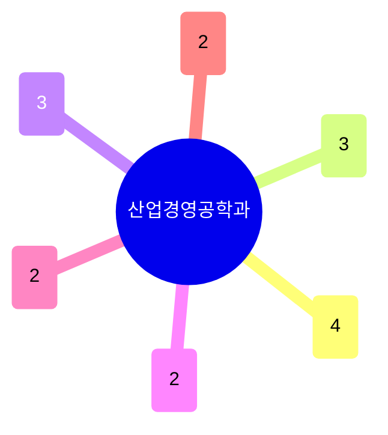

# 산업경영공학과

16명이 여섯 소그룹으로 나뉘는, POSTECH에서 가장 응용/의사결정 지향적인 학과다. **데이터과학·AI/ML**(4명)이 가장 크고, **최적화·물류·생산관리**와 **금융·리스크**가 각각 3명씩, 나머지는 **스마트팩토리·산업AI**, **인간공학·경험디자인**, **품질·사회기술** 소그룹으로 갈라진다. 저서(7건) 비중이 이공계 학과 중 유독 높다.

## 실적 요약

| 구분 | 건수 |
|---|---|
| 주도논문 | 65 |
| 공동논문 | 25 |
| 특허 | 34 |
| 과제 | 434 |
| 학회 | 278 |
| 저서 | 7 |
| 기술이전 | 3 |

## 교원 목록

### 데이터과학·AI/ML
- [고영명](../faculty/100540-고영명.md) — Queueing Theory, Time Series Foundation Models
- [모상우](../faculty/102140-모상우.md) — Multimodal Foundation Models, Robust AI
- [송민석](../faculty/100727-송민석.md) — Decision Support Systems, AI/LLM Applications
- [채민우](../faculty/101144-채민우.md) — Asymptotic Statistics, Statistical/Deep Learning

### 최적화·물류·생산관리
- [김병인](../faculty/20606-김병인.md) — Optimization, Vehicle Routing, RL
- [이강복](../faculty/100769-이강복.md) — Scheduling, Supply Chain Management
- [최동구](../faculty/100728-최동구.md) — Operations Management, Multi-agent Decision

### 금융·리스크
- [신민석](../faculty/101955-신민석.md) — Financial Econometrics, High-frequency Finance
- [장봉규](../faculty/100113-장봉규.md) — Financial Engineering, FinTech/ML
- [정광민](../faculty/101297-정광민.md) — Risk Management, Insurance Economics

### 스마트팩토리·산업AI
- [김덕영](../faculty/101232-김덕영.md) — Smart Factory, Industrial AI
- [조현보](../faculty/20279-조현보.md) — Smart Manufacturing, Value Chain Data Analytics

### 인간공학·경험디자인
- [유희천](../faculty/20493-유희천.md) — Ergonomic Design, Wearable Robot, XR Usability
- [한성호](../faculty/20241-한성호.md) — Experience Design, HCI, Adaptive UI

### 품질·사회기술
- [김광재](../faculty/20342-김광재.md) — Quality Engineering, Service Science
- [정우성](../faculty/100339-정우성.md) — Science & Technology Policy, Computational Social Science

---
[← home](../home.md) · [색인](../index.md)
