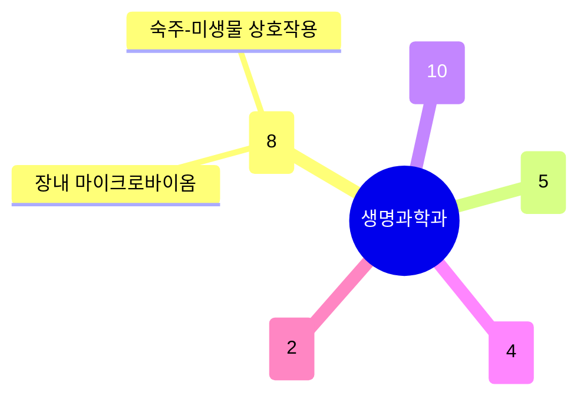

# 생명과학과

전체 학과 중 교원 수 3위(29명)이며, **면역·미생물·장내미생물** 그룹이 가장 크다(8명) — 숙주-미생물 상호작용, 장내 면역, 마이크로바이옴 치료제까지 하나의 연속된 흐름을 이룬다. **구조생물학·분자기전**과 **세포·발생·줄기세포**(식물 유전학 포함, 10명으로 표면상 가장 크지만 세부 주제가 갈라짐) 그룹이 뒤를 잇고, **암 대사**와 **신경과학**은 규모는 작지만 뚜렷한 독립 그룹이다. 과제 수(707건) 대비 특허(26건)가 적어, 기초 메커니즘 연구 비중이 높은 학과다.

## 실적 요약

| 구분 | 건수 |
|---|---|
| 주도논문 | 114 |
| 공동논문 | 81 |
| 특허 | 26 |
| 과제 | 707 |
| 학회 | 316 |
| 저서 | 0 |
| 기술이전 | 9 |

## 교원 목록

### 면역·미생물·장내미생물
- [고아라](../faculty/101443-고아라.md) — 당뇨·암과 미생물 대사, 약물 반응 개인차
- [김광순](../faculty/101205-김광순.md) — 장 면역계 발달, 미생물-면역 상호작용
- [김종흠](../faculty/101790-김종흠.md) — Plant-microbe Interactions, Plant Immunity
- [유웅재](../faculty/101696-유웅재.md) — Host-Microbe Interaction, 대사질환
- [유주연](../faculty/20564-유주연.md) — 세포내 감염 방어, Organelle Network
- [이승우](../faculty/100455-이승우.md) — 종양미세환경 면역세포, 암 면역치료
- [이윤태](../faculty/100410-이윤태.md) — Immune Cell Development, Autoimmune Disease
- [임신혁](../faculty/100621-임신혁.md) — 면역 조절·관용, 마이크로바이옴 치료제

### 구조생물학·분자기전
- [김민성](../faculty/100865-김민성.md) — 단백질 복합체 3차원 구조
- [김성철](../faculty/101953-김성철.md) — CRISPR-Cas 시스템, 단분자 생물물리
- [김영진](../faculty/101046-김영진.md) — Membrane Transporter, Structural Biology
- [이지오](../faculty/101045-이지오.md) — X-ray Crystallography, Cryo-EM, Antibody Engineering
- [조윤제](../faculty/20394-조윤제.md) — Chromosome Biology, DNA Damage Response, GPCR

### 세포·발생·줄기세포·식물
- [고용송](../faculty/20565-고용송.md) — Extracellular Vesicle 진단·치료
- [김상욱](../faculty/20611-김상욱.md) — Computational Biology, 단백질 구조 예측
- [김종경](../faculty/101505-김종경.md) — 세포 이질성, Single-cell Multiomics
- [김종민](../faculty/100971-김종민.md) — 합성 유전 회로, 정밀의료 분자 프로브
- [박승열](../faculty/101143-박승열.md) — Membrane Trafficking, Organelle Network
- [장지원](../faculty/100940-장지원.md) — Pluripotency, 인간 초기 발생, 노화
- [최규하](../faculty/100821-최규하.md) — 식물 감수분열, 식물 게놈 엔지니어링
- [최세규](../faculty/101444-최세규.md) — 성체줄기세포-니치 상호작용
- [허윤하](../faculty/101857-허윤하.md) — 조직 재생, 노화·세포노화
- [황일두](../faculty/20505-황일두.md) — 혈관 발달, 식물 스트레스 반응

### 암·대사·질환
- [박상기](../faculty/20673-박상기.md) — 도파민 관련 정신질환, 기분장애
- [백승태](../faculty/100818-백승태.md) — 소아 뇌전증 유전학, 신경발달장애
- [성영철](../faculty/20164-성영철.md) — 신규 백신·면역치료제 개발
- [이민식](../faculty/101753-이민식.md) — 종양미세환경 대사, 암 대사

### 신경과학
- [김정훈](../faculty/20610-김정훈.md) — 시냅스 가소성, 중독 행동의 세포 기전
- [김태경](../faculty/101011-김태경.md) — 뇌 기능 후성유전학, 회로 매핑 도구

---
[← home](../home.md) · [색인](../index.md)
