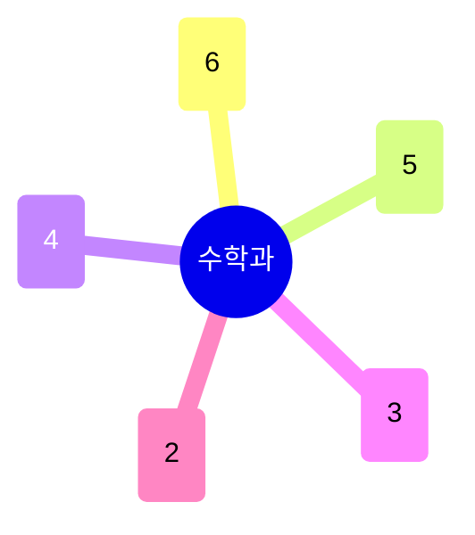

# 수학과

순수수학 두 축 — **정수론·대수기하**(6명)와 **심플렉틱기하·위상수학**(5명) — 이 학과의 중심을 이루고, **확률론·통계**(4명)가 뒤를 받친다. 최근 몇 년 사이 **계산수학·AI 수학**(수치해석, Scientific ML) 그룹이 새로 두꺼워지는 흐름이 눈에 띈다 (정재훈·최민석·황형주). 특허(4건)·기술이전(0건)으로 실적 성격이 다른 이공계 학과와 뚜렷이 다르며, 저서(5건) 비중이 상대적으로 높다.

## 실적 요약

| 구분 | 건수 |
|---|---|
| 주도논문 | 79 |
| 공동논문 | 20 |
| 특허 | 4 |
| 과제 | 287 |
| 학회 | 158 |
| 저서 | 5 |
| 기술이전 | 0 |

## 교원 목록

### 정수론·대수기하
- [Qirui Li](../faculty/101798-Qirui Li.md) — Arithmetic Geometry, Shimura Varieties
- [Valentin Buciumas](../faculty/101792-Valentin Buciumas.md) — Representation Theory, Number Theory
- [박지훈](../faculty/20530-박지훈.md) — Birational/Complex Geometry (학과 공통 포털)
- [이경석](../faculty/101754-이경석.md) — Algebraic Geometry (학과 공통 포털)
- [조성문](../faculty/100941-조성문.md) — Number Theory
- [최영주](../faculty/20177-최영주.md) — Modular Forms, L-functions, Automorphic Forms

### 심플렉틱기하·위상수학
- [박재석](../faculty/20514-박재석.md) — QFT 수학적 기초, Homotopy/Symplectic Geometry (학과 공통 포털)
- [오용근](../faculty/100288-오용근.md) — Symplectic Geometry, Floer Theory, Mirror Symmetry
- [전보광](../faculty/100869-전보광.md) — Hyperbolic 3-manifolds (학과 공통 포털)
- [조철현](../faculty/102126-조철현.md) — Symplectic Topology, Mirror Symmetry, Singularity (학과 공통 포털)
- [차재춘](../faculty/100064-차재춘.md) — Knot Theory, Low-dimensional Topology

### 확률론·통계
- [김건우](../faculty/100745-김건우.md) — Probability, Stochastic PDE
- [김진수](../faculty/101468-김진수.md) — Stochastic Reaction Networks, Mathematical Biology
- [손영환](../faculty/100744-손영환.md) — Ergodic Theory
- [신선영](../faculty/101561-신선영.md) — Statistical Learning, Statistical Genomics

### 계산수학·AI 수학
- [정재훈](../faculty/101302-정재훈.md) — Numerical Analysis, Mathematical Data Science
- [최민석](../faculty/101896-최민석.md) — Scientific ML, Uncertainty Quantification
- [황형주](../faculty/20665-황형주.md) — Mathematical AI, AI-based Simulation

### 해석학·PDE
- [이동현](../faculty/100972-이동현.md) — Applied PDE, Fluid Mechanics, Kinetic Theory
- [장진우](../faculty/101446-장진우.md) — PDE, Applied Analysis, Kinetic Theory

---
[← home](../home.md) · [색인](../index.md)
