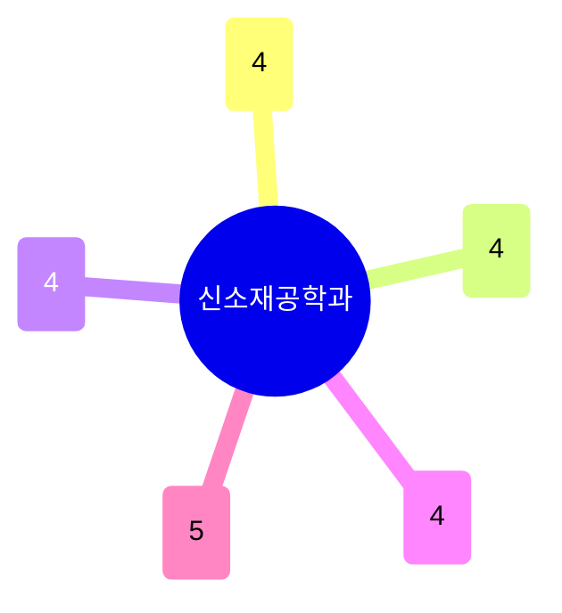

# 신소재공학과

21명이 다섯 갈래로 고르게 나뉘어 있다: **에너지저장·전기화학**(배터리·촉매), **반도체·양자물질 박막/에피택시**, **광전자·디스플레이**, **나노/바이오소재**, **계산재료·특성분석/메모리소자**. 특허 139건·기술이전 11건으로 응용 지향성이 뚜렷하고, 물리학과(응집물질)·화학공학과(에너지)와 연구 접점이 많다.

## 실적 요약

| 구분 | 건수 |
|---|---|
| 주도논문 | 282 |
| 공동논문 | 154 |
| 특허 | 139 |
| 과제 | 530 |
| 학회 | 439 |
| 저서 | 1 |
| 기술이전 | 11 |

## 교원 목록

### 에너지저장·전기화학·촉매
- [강병우](../faculty/100409-강병우.md) — Li-ion Battery Thermodynamics, All-solid-state Battery
- [권순호](../faculty/102202-권순호.md) — Theory-driven Catalyst Design, Multi-scale Simulation
- [김용태](../faculty/101047-김용태.md) — Electrocatalysis, Battery Cathode Recycling
- [천동원](../faculty/102025-천동원.md) — Hydrogen Storage, Metal-hydrides Synthesis

### 반도체·양자물질 박막
- [강종훈](../faculty/101601-강종훈.md) — Thin Film Epitaxy, 2D/3D vdW Heterostructures
- [이동화](../faculty/100844-이동화.md) — Semiconductor Interface Thermodynamics, Superconducting Qubit Noise
- [조문호](../faculty/20596-조문호.md) — 2D vdW Epitaxy, Quantum Computing/Sensing Platforms
- [한현](../faculty/101938-한현.md) — Epitaxial Oxide Growth, Correlated Quantum Phenomena

### 광전자·디스플레이
- [김종규](../faculty/100219-김종규.md) — Semiconductor Light Emitters, UV LED
- [정성준](../faculty/100584-정성준.md) — Organic Printed Electronics, Digital Healthcare Sensor
- [정운룡](../faculty/100679-정운룡.md) — Stretchable Electronics, E-skin
- [조창순](../faculty/101729-조창순.md) — Perovskite Photovoltaics, LED/Laser Optoelectronics

### 나노/바이오소재
- [김연수](../faculty/100923-김연수.md) — Bio-inspired Self-assembly, Functional Polymer/Gel
- [오승수](../faculty/100764-오승수.md) — Aptamer/Ribozyme, Synthetic Biomaterials
- [이준민](../faculty/101467-이준민.md) — Biomaterials for Tissue Engineering, Organ-on-a-chip
- [한세광](../faculty/20630-한세광.md) — Biomedical Nanomaterials, Bioimaging

### 계산재료·특성분석·소자
- [김종환](../faculty/100817-김종환.md) — Optical Characterization, Ultrafast Nanomaterial Science
- [이병주](../faculty/20480-이병주.md) — Atomistic Simulation, CALPHAD, ML Materials Design
- [이장식](../faculty/100537-이장식.md) — Neuromorphic Devices, Ferroelectric Memory
- [최시영](../faculty/100871-최시영.md) — Aberration-corrected STEM, In-situ Analysis
- [황현상](../faculty/100484-황현상.md) — ReRAM, Neuromorphic Device

---
[← home](../home.md) · [색인](../index.md)
