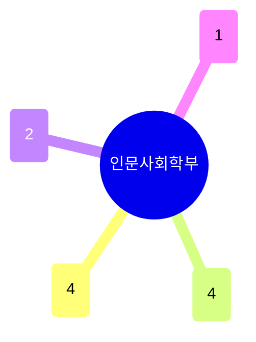

# 인문사회학부

이공계 중심 대학에서 인문·사회과학의 폭을 대표하는 학부. 다른 학과처럼 하나의 기술적 계보로 묶이지 않고, **정치·사회·정책**과 **언어·문학·문화**가 각 4명으로 가장 크며, **인지과학·철학**이 뒤를 잇는다. 논문 대비 저서(10건) 비중이 전체 학과 중 가장 높다 — 인문학 특유의 단행본 중심 업적 관행을 반영한다.

## 실적 요약

| 구분 | 건수 |
|---|---|
| 주도논문 | 10 |
| 공동논문 | 9 |
| 특허 | 0 |
| 과제 | 89 |
| 학회 | 67 |
| 저서 | 10 |
| 기술이전 | 0 |

## 교원 목록

### 정치·사회·정책
- [강명훈](../faculty/101769-강명훈.md) — Formal Theory, Political Institutions, Korean Politics
- [배영](../faculty/101177-배영.md) — Information Sociology, Social Network Analysis
- [신훈철](../faculty/102076-신훈철.md) — Environmental Policy, Risk Governance
- [정진호](../faculty/102146-정진호.md) — Agricultural/Food Market Analysis, Policy

### 언어·문학·문화
- [권수옥](../faculty/20539-권수옥.md) — Second Language Acquisition, Sentence Processing
- [김진희](../faculty/100416-김진희.md) — Media Psychology, Cross-cultural Communication
- [박상준](../faculty/20540-박상준.md) — Modern Korean Literature (학과 공통 포털)
- [우정아](../faculty/100475-우정아.md) — Modern/Contemporary Art History (Korea/US)

### 인지과학·철학
- [서지현](../faculty/101439-서지현.md) — Cognitive Psychology/Neuroscience, Visual Attention
- [이충형](../faculty/100739-이충형.md) — Philosophy of Science, Metaphysics, Logic

### 운동생리학
- [육장수](../faculty/102052-육장수.md) — Exercise Physiology, Neuroscience of Exercise

---
[← home](../home.md) · [색인](../index.md)
