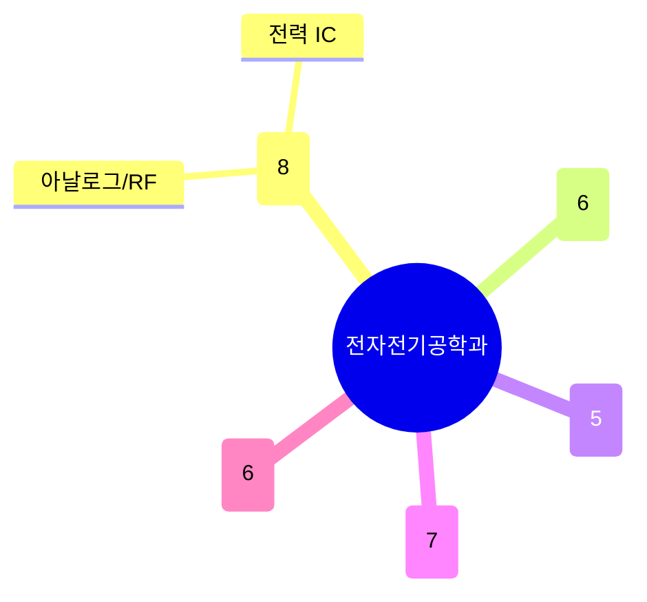

# 전자전기공학과

주도논문(333건)·특허(255건) 모두 전체 학과 중 최상위권으로, 반도체 소자부터 통신, 양자소자, 로보틱스/제어, 디스플레이까지 스펙트럼이 넓다. 다만 겹치는 축이 뚜렷하다: **아날로그/RF/전력 집적회로**가 가장 큰 축이고, 그 위에 **무선통신·신호처리**, **양자·뉴로모픽 컴퓨팅 소자**(공병돈·이문주 등 물리학과와도 맞닿는 영역), **제어·로보틱스·AI 응용**, **디스플레이·전력에너지**가 이어진다.

## 실적 요약

| 구분 | 건수 |
|---|---|
| 주도논문 | 333 |
| 공동논문 | 97 |
| 특허 | 255 |
| 과제 | 878 |
| 학회 | 755 |
| 저서 | 5 |
| 기술이전 | 9 |

## 교원 목록

### 반도체 소자·집적회로
- [김병섭](../faculty/100449-김병섭.md) — Analog Layout/Circuit Optimization, High-speed Link, ADC
- [백록현](../faculty/100820-백록현.md) — Multi-gate Device, 3D NAND, TCAD
- [송호진](../faculty/100740-송호진.md) — RF/Analog IC, mmWave/THz, Cryo-CMOS
- [신세운](../faculty/101768-신세운.md) — Analog IC, Power Management, Wireless Power
- [심재윤](../faculty/20628-심재윤.md) — 저전력 센서 인터페이스, 양자컴퓨팅 회로
- [이병훈](../faculty/101352-이병훈.md) — Extreme Low-power Computing, 2D 소자
- [이정수](../faculty/100128-이정수.md) — Nanoscale Device Fabrication, Biosensor
- [정윤영](../faculty/100675-정윤영.md) — Flexible/Wearable Device, Healthcare Sensor

### 무선통신·신호처리
- [김경태](../faculty/20443-김경태.md) — Radar, SAR/ISAR Imaging, EW
- [김용준](../faculty/101602-김용준.md) — Semantic Communication, Coding Theory
- [양경철](../faculty/20376-양경철.md) — Digital Communications, CDMA/OFDM
- [이남윤](../faculty/102092-이남윤.md) — MIMO Communications, Satellite Networks
- [전요셉](../faculty/101231-전요셉.md) — Wireless Communications, MIMO, ML for Comm
- [조준호](../faculty/20583-조준호.md) — Digital Comm/Network, Financial Signal Processing

### 양자·뉴로모픽 컴퓨팅 소자
- [공병돈](../faculty/100959-공병돈.md) — Semiconductor Physics, Quantum Devices, THz
- [김세영](../faculty/101223-김세영.md) — Neuromorphic Devices, AI Hardware
- [나동엽](../faculty/101599-나동엽.md) — Computational Electromagnetics, Plasma
- [이문주](../faculty/101259-이문주.md) — Ion Trap, Quantum Computing/Networks
- [이승구](../faculty/20206-이승구.md) — Hardware-efficient Neural Networks

### 제어·로보틱스·AI 응용
- [강석형](../faculty/100958-강석형.md) — ML 기반 회로 설계 자동화, 양자 회로 최적화
- [김광인](../faculty/101715-김광인.md) — Robust/Distributed Learning, Vision
- [김상우](../faculty/20229-김상우.md) — Optimal Control, Adaptive Signal Processing
- [김정훈](../faculty/101134-김정훈.md) — Mathematical Control Theory, Robotics
- [박부견](../faculty/20329-박부견.md) — Robust/Fuzzy Control, Explainable AI
- [안혜민](../faculty/102151-안혜민.md) — AI-based Human-Robot Interaction
- [이재호](../faculty/101549-이재호.md) — Efficient AI, Deep Learning Theory

### 디스플레이·광전자·전력에너지
- [김영진](../faculty/100779-김영진.md) — Smart Buildings, Microgrid, 분산 에너지
- [김욱성](../faculty/100864-김욱성.md) — Future Display, Holographic/LC Array
- [채수용](../faculty/101578-채수용.md) — Power Electronics, Distributed Energy
- [최수석](../faculty/101033-최수석.md) — Display Technology, Stretchable Display
- [한해욱](../faculty/20336-한해욱.md) — Nano-Bio/THz Photonics, Semiconductor Laser
- [홍원빈](../faculty/100737-홍원빈.md) — Antenna Theory, Microwave, Remote Sensing

---
[← home](../home.md) · [색인](../index.md)
