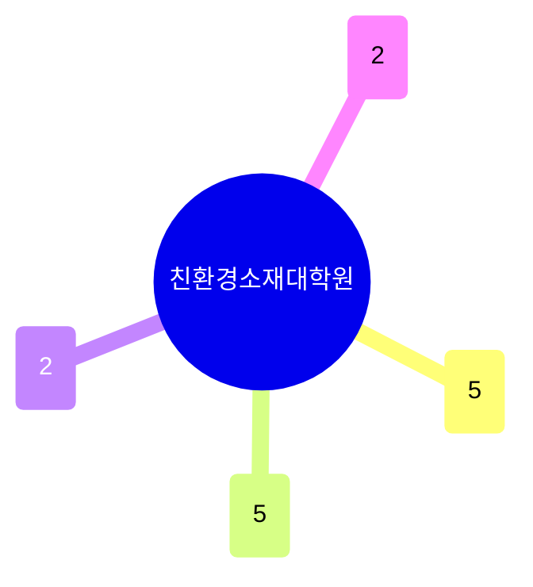

# 친환경소재대학원

POSTECH의 철강 전통이 이어지는 대학원으로, **철강·제련·야금**(제철소 공정·슬래그·합금설계, 5명)이 여전히 중심이지만 **배터리·에너지저장 소재**(양극재·전해질·리사이클링) 그룹이 동일한 규모(5명)로 성장해 사실상 두 축 체제다. 계산재료·합금설계와 원자력 재료가 소규모로 존재한다.

## 실적 요약

| 구분 | 건수 |
|---|---|
| 주도논문 | 172 |
| 공동논문 | 116 |
| 특허 | 19 |
| 과제 | 380 |
| 학회 | 225 |
| 저서 | 0 |
| 기술이전 | 0 |

## 교원 목록

### 철강·제련·야금
- [강윤배](../faculty/100248-강윤배.md) — Clean Steel Production, Hydrogen-based Ironmaking
- [서동우](../faculty/100228-서동우.md) — Physical Metallurgy of Ferrous Alloys
- [정성모](../faculty/20402-정성모.md) — Alternative Ironmaking, Waste Recycling
- [조중욱](../faculty/100743-조중욱.md) — Slag Systems, Oxide Metallurgy
- [허윤욱](../faculty/100983-허윤욱.md) — Advanced Material Characterization, Steel Fracture

### 배터리·에너지저장 소재
- [박규영](../faculty/101433-박규영.md) — Li/Na-ion Battery Materials, Synchrotron Analysis
- [이민아](../faculty/101936-이민아.md) — Electrolytes/Interphases, Battery Safety/Recycling
- [이상민](../faculty/101930-이상민.md) — Fast-charging Anode, All-solid Battery
- [조창신](../faculty/101539-조창신.md) — Next-gen Battery Systems, Electrode Materials
- [홍지현](../faculty/101937-홍지현.md) — Low-cost Li-ion Materials, Cathode-electrolyte Interface

### 계산재료·합금설계
- [김경덕](../faculty/101434-김경덕.md) — Multiscale Phase Transformation Modeling, ML Materials Discovery
- [김형섭](../faculty/100130-김형섭.md) — Ultrafine Grained Materials, High Entropy Alloys, 3D Printing

### 원자력재료·프로젝트관리
- [염화성](../faculty/101697-염화성.md) — Nuclear Fuel/Structural Materials for SMR
- [이을범](../faculty/100493-이을범.md) — Engineering/Project Management, Oil & Gas

---
[← home](../home.md) · [색인](../index.md)
