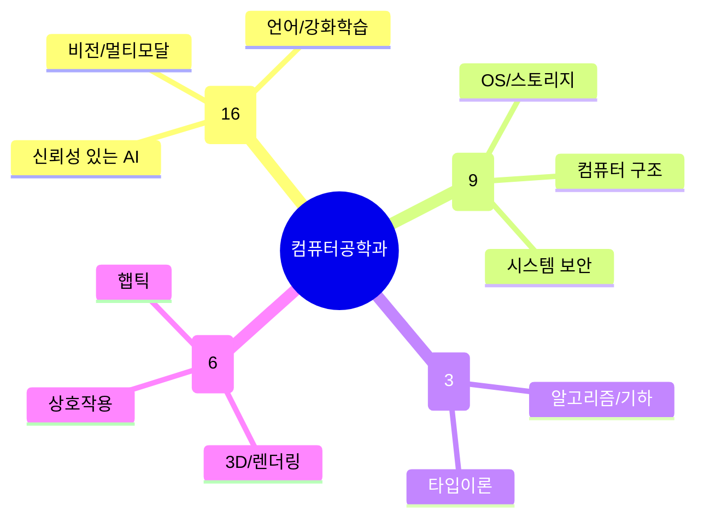

# 컴퓨터공학과

POSTECH에서 교원 수가 가장 많은 학과(34명)로, 크게 네 흐름이 겹쳐 있다: **AI/ML이 압도적 비중**(16명, 거의 절반)을 차지하고, 그 아래를 **시스템·아키텍처·보안**이 받치며, **이론·프로그래밍언어** 소그룹과 **그래픽스·HCI**가 응용 접점을 이룬다. 특허(184건)·기술이전(13건)이 다른 학과 대비 높은 편으로, 이론보다 시스템/응용 쪽 산업 연계가 활발한 편이다.

## 실적 요약

| 구분 | 건수 |
|---|---|
| 주도논문 | 57 |
| 공동논문 | 42 |
| 특허 | 184 |
| 과제 | 830 |
| 학회 | 684 |
| 저서 | 2 |
| 기술이전 | 13 |

## 교원 목록

### AI/ML & 데이터
- [고성안](../faculty/102077-고성안.md) — Generative AI, Vision-Language Models, AGI
- [곽수하](../faculty/100926-곽수하.md) — Computer Vision, Machine Learning
- [김동우](../faculty/101219-김동우.md) — Machine Learning, Deep Learning
- [김원화](../faculty/101359-김원화.md) — Medical Imaging, Machine Learning, Computer Vision
- [김형훈](../faculty/102053-김형훈.md) — NLP, Multimodal Learning, Embodied AI
- [류일우](../faculty/101859-류일우.md) — Medical Imaging, Computer Vision/Graphics
- [박상돈](../faculty/101770-박상돈.md) — Trustworthy ML, AI Safety
- [박은혁](../faculty/101304-박은혁.md) — Deep Learning Optimization, HW/SW Co-design
- [손진희](../faculty/102147-손진희.md) — Computer Vision, Machine Learning
- [옥정슬](../faculty/101165-옥정슬.md) — RL, Computational Social Science
- [유환조](../faculty/100090-유환조.md) — Big Data, NLP, Machine Learning
- [이근배](../faculty/20220-이근배.md) — Speech/NLP, Dialog Systems
- [이남훈](../faculty/101506-이남훈.md) — Machine Learning, Optimization
- [이원열](../faculty/102028-이원열.md) — Continuous Computation, PL, ML
- [조민수](../faculty/100777-조민수.md) — Computer Vision, Pattern Recognition
- [조성현](../faculty/101166-조성현.md) — Computational Photography, Vision/Graphics

### 시스템·아키텍처·보안
- [김광선](../faculty/101025-김광선.md) — Computer Architecture, Near-data Processing, NPU
- [김슬배](../faculty/101858-김슬배.md) — Cyber-Physical Systems, Software Security
- [박지성](../faculty/101600-박지성.md) — Architecture, OS, System Security
- [박찬익](../faculty/20136-박찬익.md) — Blockchain, Trusted Computing, Storage
- [배경민](../faculty/100729-배경민.md) — Software Verification, Formal Methods
- [서영주](../faculty/20362-서영주.md) — IoT, Indoor Positioning, Voice AI
- [이성진](../faculty/102093-이성진.md) — Computer Systems, Storage/Memory, AI Systems
- [전명재](../faculty/101944-전명재.md) — OS, AI/Big Data Systems, Cloud
- [한욱신](../faculty/100581-한욱신.md) — Parallel Big Data Systems, Graph Computation

### 이론·프로그래밍언어
- [박성우](../faculty/20678-박성우.md) — Parallel Programming, Deductive Verification, Type Theory
- [안희갑](../faculty/100051-안희갑.md) — Discrete Geometry, Algorithms
- [오은진](../faculty/101146-오은진.md) — Discrete Geometry, Algorithms

### 그래픽스·HCI
- [백승환](../faculty/101504-백승환.md) — Computer Graphics/Vision, Computational Imaging
- [송황준](../faculty/20608-송황준.md) — VR/AR Streaming, 5G Networking
- [이승용](../faculty/20333-이승용.md) — Computer Graphics, Computational Photography
- [조은경](../faculty/102141-조은경.md) — HCI, CSCW, Health Informatics
- [최승문](../faculty/20629-최승문.md) — Haptics, VR/HCI
- [황인석](../faculty/101303-황인석.md) — Human-AI Interaction, XR/Metaverse

---
[← home](../home.md) · [색인](../index.md)
