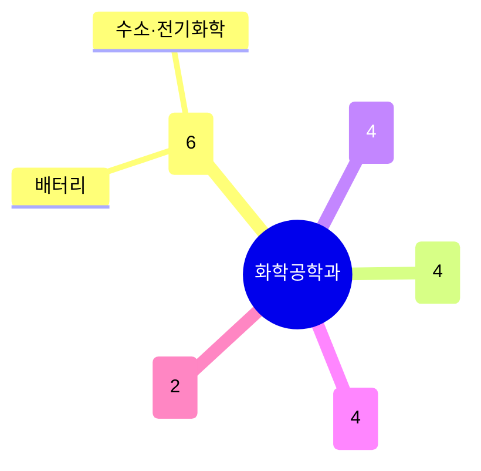

# 화학공학과

주도논문(355건)이 전체 학과 중 가장 많다. **에너지변환·촉매**(배터리·수소·전기화학)가 가장 큰 축(6명)이고, **반도체/전자재료**, **합성생물학·바이오분자공학**이 각각 4명씩 뚜렷한 그룹을 이룬다. 고분자·계면 소재 그룹도 꾸준한 규모를 유지한다.

## 실적 요약

| 구분 | 건수 |
|---|---|
| 주도논문 | 355 |
| 공동논문 | 105 |
| 특허 | 134 |
| 과제 | 592 |
| 학회 | 436 |
| 저서 | 0 |
| 기술이전 | 7 |

## 교원 목록

### 에너지변환·촉매
- [김원배](../faculty/100770-김원배.md) — Batteries, Fuel Cells, Electrochemical Processes
- [용기중](../faculty/20410-용기중.md) — Green Ammonia, Artificial Photosynthesis, H2
- [윤용주](../faculty/100771-윤용주.md) — Heterogeneous Catalysis, Surface Science
- [윤창원](../faculty/101432-윤창원.md) — Chemical Hydrogen Storage, CO2 Conversion
- [이기라](../faculty/101365-이기라.md) — Colloidal Self-assembly, Battery Recycling
- [한지훈](../faculty/101576-한지훈.md) — CO2/Biomass-to-fuel, Techno-economic Assessment

### 반도체·전자재료
- [김철주](../faculty/100816-김철주.md) — 2D Materials Electronics/Opto-electronics
- [노용영](../faculty/101032-노용영.md) — Perovskite Transistor/Memory, Oxide Electronics
- [손재성](../faculty/101794-손재성.md) — Colloidal Nanoparticle 3D Printing, 반도체 소자
- [정대성](../faculty/101243-정대성.md) — Organic Image Sensors, Printing-based M3D

### 합성생물학·바이오분자공학
- [이정욱](../faculty/100873-이정욱.md) — Genetic Circuit, Engineered Probiotics
- [이준구](../faculty/101367-이준구.md) — Cell-free Polymer Synthesis
- [정규열](../faculty/20602-정규열.md) — Metabolic Engineering, Synthetic Biology
- [정우빈](../faculty/101951-정우빈.md) — Bio-electrochemical Computing, BCI

### 고분자·계면·소프트소재
- [김영기](../faculty/101153-김영기.md) — Smart Material, Colloidal Self-assembly, Drug Release
- [이효민](../faculty/100872-이효민.md) — Optical Coatings, Droplet Microfluidics
- [조길원](../faculty/20099-조길원.md) — Polymer Physics, Organic Electronics
- [차형준](../faculty/20385-차형준.md) — Mussel/Silk-based Biomaterials

### 단백질·재료설계 계산
- [이상민](../faculty/101831-이상민.md) — Protein Design, Computational Materials Science
- [전상민](../faculty/20607-전상민.md) — Energy Harvesting, Carbon Neutrality

---
[← home](../home.md) · [색인](../index.md)
