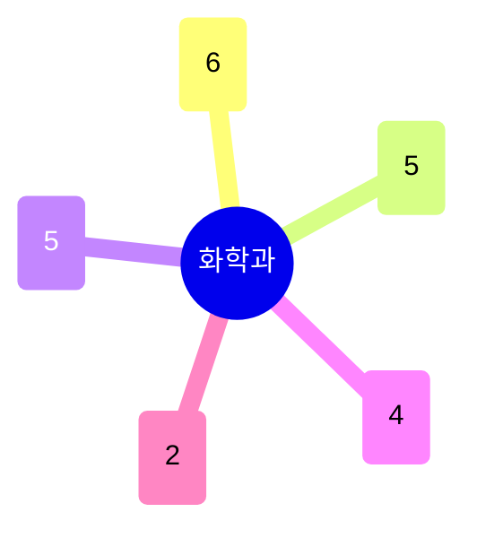

# 화학과

**유기합성·촉매반응**이 가장 큰 축(6명)으로, 비대칭 촉매·전기화학적 유기합성까지 포괄한다. **구조/분광·물리화학**(5명)과 **생체분자·화학생물학·약물전달**(5명)이 뒤를 이으며, **나노소재·에너지저장**(고분자 전해질·MOF·배터리)이 신소재공학과·화학공학과와 접점을 이룬다.

## 실적 요약

| 구분 | 건수 |
|---|---|
| 주도논문 | 208 |
| 공동논문 | 93 |
| 특허 | 57 |
| 과제 | 556 |
| 학회 | 374 |
| 저서 | 1 |
| 기술이전 | 7 |

## 교원 목록

### 유기합성·촉매반응
- [김현우](../faculty/101598-김현우.md) — Radical Catalysis, Electrochemical Organic Synthesis
- [이영호](../faculty/20633-이영호.md) — Transition Metal Catalysis, Total Synthesis
- [조승환](../faculty/100636-조승환.md) — Asymmetric Reactions, Organoboron Cross-coupling
- [지형민](../faculty/101160-지형민.md) — Enantioselective Catalysis, Organocatalysts
- [최창혁](../faculty/101538-최창혁.md) — Electrocatalysis, Electrochemical Synthesis
- [황승준](../faculty/101145-황승준.md) — Main Group/Electro Catalysts

### 구조/분광·물리화학
- [김경환](../faculty/100982-김경환.md) — X-ray Scattering/Spectroscopy, Water Anomalies
- [류순민](../faculty/100643-류순민.md) — Exciton Dynamics in 2D Molecular Crystals
- [서종철](../faculty/100973-서종철.md) — Ion Mobility Mass Spectrometry
- [심지훈](../faculty/100157-심지훈.md) — Computational/Solid State Chemistry, DFT
- [주태하](../faculty/20308-주태하.md) — Femtosecond Spectroscopy, Coherent Dynamics

### 생체분자·화학생물학
- [권도훈](../faculty/102074-권도훈.md) — Membrane Protein Structural Biology, Cryo-EM
- [김원종](../faculty/100053-김원종.md) — Biopolymer Chemistry, Drug/Gene Delivery
- [서대하](../faculty/102149-서대하.md) — Single-molecule Biophysics, Nanomedicine
- [임현석](../faculty/100454-임현석.md) — Protein-mimetic Drug Discovery
- [장영태](../faculty/100858-장영태.md) — Fluorescent Sensors/Probes, Chemical Aging

### 나노소재·에너지저장
- [박문정](../faculty/100159-박문정.md) — Polymer Electrolytes, Block Copolymer Self-assembly
- [박선아](../faculty/101228-박선아.md) — Electron/Ion-conductive MOFs, Energy Storage
- [박수진](../faculty/100977-박수진.md) — All Solid-state/Li Metal Batteries
- [최희철](../faculty/20547-최희철.md) — 2D Materials CVD, MOF/COF, Molecular Electronics

### 나노입자·양자점
- [김성지](../faculty/20634-김성지.md) — Quantum Dot Optics/Optoelectronic Devices
- [이인수](../faculty/100412-이인수.md) — Metal/Metal Oxide Nanocrystal Synthesis

---
[← home](../home.md) · [색인](../index.md)
