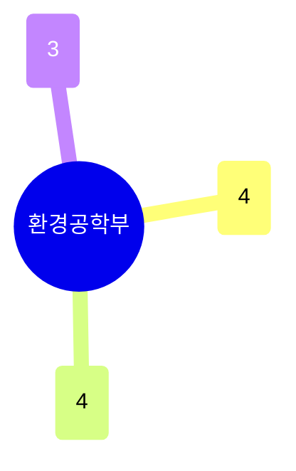

# 환경공학부

11명이 **기후·대기**(4명)와 **수처리·분리막·환경정화**(4명) 두 축으로 균형있게 나뉘고, **환경생지화학·재료**(방사성폐기물·생체모방재료 포함)가 나머지를 채운다. 특허(43건) 비중이 학과 규모 대비 높은 편으로, 분리막·촉매 등 처리 기술의 응용성이 두드러진다.

## 실적 요약

| 구분 | 건수 |
|---|---|
| 주도논문 | 117 |
| 공동논문 | 79 |
| 특허 | 43 |
| 과제 | 291 |
| 학회 | 253 |
| 저서 | 2 |
| 기술이전 | 6 |

## 교원 목록

### 기후·대기
- [감종훈](../faculty/101224-감종훈.md) — Hydroclimatology, Disaster Informatics
- [민승기](../faculty/100544-민승기.md) — Climate Extremes, Statistical Climatology
- [이기택](../faculty/20449-이기택.md) — Ocean Carbon Sequestration, Ocean Acidification
- [이형주](../faculty/101516-이형주.md) — Air Pollution, Satellite Remote Sensing

### 수처리·분리막·환경정화
- [송우철](../faculty/101698-송우철.md) — Membrane Separation, Desalination
- [조강우](../faculty/100825-조강우.md) — Electrochemical Wastewater Treatment
- [홍석봉](../faculty/100032-홍석봉.md) — Nanoporous Materials, H2/CO2 Separation
- [황석환](../faculty/20353-황석환.md) — Biological Waste Management, Biogas

### 환경생지화학·재료
- [권세윤](../faculty/100934-권세윤.md) — Isotope Biogeochemistry, Heavy Metal Tracing
- [엄우용](../faculty/100855-엄우용.md) — Radioactive Waste Management, Soil Remediation
- [황동수](../faculty/100293-황동수.md) — Biomimetic Materials, Fouling/Antifouling

---
[← home](../home.md) · [색인](../index.md)
