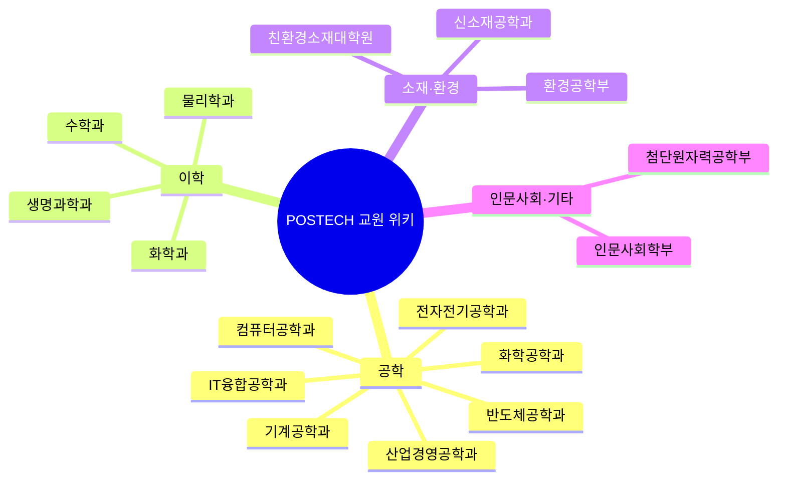

# POSTECH 교원 R&D 위키

POSTECH 교원 298명의 R&D 실적 데이터베이스와 홈페이지 크롤링 원문을 원본(source)으로 삼아,
LLM이 직접 읽고 종합해 유지하는 지식베이스입니다. 설계는
[Andrej Karpathy의 "LLM Wiki" 패턴](https://gist.github.com/karpathy/442a6bf555914893e9891c11519de94f)을
따릅니다 — 구조와 갱신 규칙은 [CLAUDE.md](../CLAUDE.md)를 보세요.

## 학과를 가로지르는 흐름

16개 학과를 다 읽어보면 몇 가지 반복되는 축이 드러납니다:

- **AI/ML은 이미 학과 경계가 없다.** 컴퓨터공학과(16/34명)가 가장 두껍지만, 전자전기공학과(로보틱스·AI 응용), 산업경영공학과(4/16명이 AI/ML), 수학과(계산수학·AI 수학 3명), 기계공학과(AI for fluid mechanics)까지 — AI/ML은 이제 개별 도메인이 아니라 여러 학과에 스며든 방법론에 가깝습니다.
- **양자(quantum)는 물리학과·전자전기공학과·신소재공학과 세 곳에서 각자 다른 각도로 다뤄집니다** — 물리학과는 양자정보·양자광학(실험), 전자전기공학과는 양자컴퓨팅 회로·이온트랩, 신소재공학과는 양자물질 박막/에피택시. 세 그룹이 실제로는 서로의 연구에 필요한 물질·소자·이론을 주고받는 관계일 가능성이 높습니다.
- **에너지저장(배터리)은 신소재공학과·화학과·화학공학과·친환경소재대학원 네 곳에 걸쳐 있습니다.** 관점만 다릅니다: 신소재공학과는 소재·박막, 화학과는 전해질/촉매 화학, 화학공학과는 공정·시스템, 친환경소재대학원은 철강 전통에서 이어진 산업화 관점.
- **의료·헬스케어**는 IT융합공학과(뇌과학·의료기기, 기술이전 최상위)가 중심이지만 기계공학과(바이오메디컬 로봇)·신소재공학과(바이오소재)·화학과(약물전달)에도 흩어져 있습니다.

## 학과별 MOC

- [컴퓨터공학과](domain/컴퓨터공학과.moc.md) (34명) — AI/ML이 절반 가까이
- [전자전기공학과](domain/전자전기공학과.moc.md) (32명) — 반도체 소자부터 로보틱스까지
- [생명과학과](domain/생명과학과.moc.md) (29명) — 면역·미생물이 가장 큰 축
- [물리학과](domain/물리학과.moc.md) (28명) — 응집물질 실험이 중심
- [기계공학과](domain/기계공학과.moc.md) (24명) — 열유체·에너지시스템
- [화학과](domain/화학과.moc.md) (22명) — 유기합성·촉매반응
- [신소재공학과](domain/신소재공학과.moc.md) (21명) — 다섯 갈래로 고른 분포
- [수학과](domain/수학과.moc.md) (20명) — 정수론·대수기하 + 심플렉틱기하
- [화학공학과](domain/화학공학과.moc.md) (20명) — 에너지변환·촉매
- [산업경영공학과](domain/산업경영공학과.moc.md) (16명) — 데이터과학·AI/ML
- [친환경소재대학원](domain/친환경소재대학원.moc.md) (14명) — 철강 전통 + 배터리
- [IT융합공학과](domain/IT융합공학과.moc.md) (11명) — 뇌과학·신경조절
- [인문사회학부](domain/인문사회학부.moc.md) (11명) — 정치·사회·정책 + 언어·문학
- [환경공학부](domain/환경공학부.moc.md) (11명) — 기후·대기 + 수처리
- [반도체공학과](domain/반도체공학과.moc.md) (4명) — 신설, 아직 소규모
- [첨단원자력공학부](domain/첨단원자력공학부.moc.md) (1명) — 원자력 × AI/시뮬레이션

## 그 밖의 진입점

- [색인 (index.md)](index.md) — 전체 교원·학과 평면 카탈로그 (기계 생성, 재실행 시 최신화)
- [연구분야 키워드 인덱스](research-areas.md) — 키워드로 교원 찾기
- [전체 교원 가나다순 목록](faculty-index.md)
- [log.md](log.md) — 이 위키가 어떻게 만들어져 왔는지 시간순 기록
- [open-questions.md](open-questions.md) — 데이터 모순·미해결 이슈 (린트 결과)
